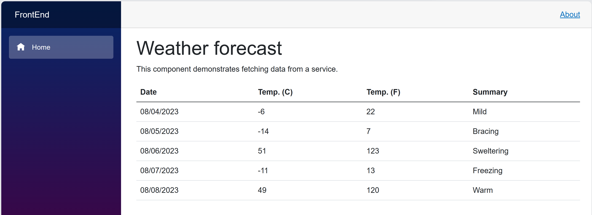
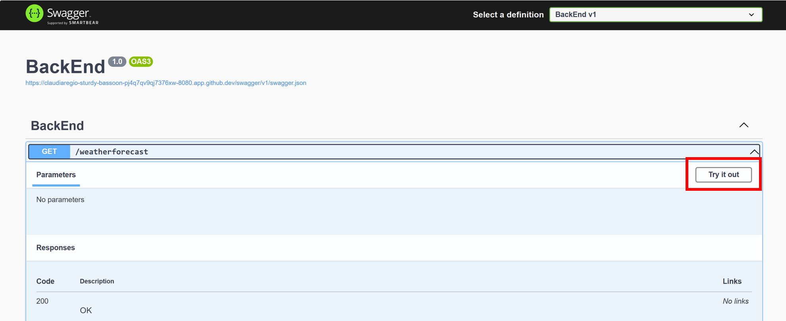

# blazor
Component-based SPA framework that achieves interactivity with C#.

[.NET core Tools](https://learn.microsoft.com/en-us/dotnet/core/tools/)https://learn.microsoft.com/en-us/dotnet/core/tools/

# Running
- Using vscode tasks
CTRL + SHIFT + B

# Configure git repo
git config --global --add safe.directory /workspaces/blazor

# Get icons
https://icones.js.org/collection/oi

### Run Options

You can also run this repository locally by following these instructions: 
1. Clone the repo to your local machine
1. Open repo in VS Code

## Getting started

1. **▶️ Run all, one-click again**: Use VS Code's built-in *Run* command and open the forwarded ports *8080* and *8081* in your browser. 

3. The Blazor web app and Swagger tabs should now be open on your browser. On Swagger, click "Try it out" and "Execute" to call and test the API. 

4. **🔄 Iterate quickly:** Codespaces updates the server on each save, and VS Code's debugger lets you dig into the code execution.

5. To stop running, return to VS Code, and click Stop twice in the debug toolbar. 

# Error port already in use
- lsof -w -n -i tcp:8080
- lsof -w -n -i tcp:8081
- Get the PID
- kill -9 PID

# Structure
- ToDoApp.sln
- BackEnd/
- FrontEnd/

# Check version
dotnet --version

# See all templates installed
dotnet new list

# Create a new solution
dotnet new sln -n ToDoApp

# Create a new Blazor Server project
dotnet new blazor -n FrontEnd --interactivity --help
dotnet new blazor -n FrontEnd --interactivity None

# Add the new Blazor Server project to the solution
dotnet sln ToDoApp.sln add FrontEnd/FrontEnd.csproj

# Restores the dependencies and tools of a project.
dotnet restore

# Runs source code without any explicit compile or launch commands.
dotnet run

# Clean and build the solution
dotnet clean ToDoApp.sln; dotnet build ToDoApp.sln

# Blazor Templates
- Blazor Web App project template: blazor
- Standalone Blazor WebAssembly app project template: blazorwasm
